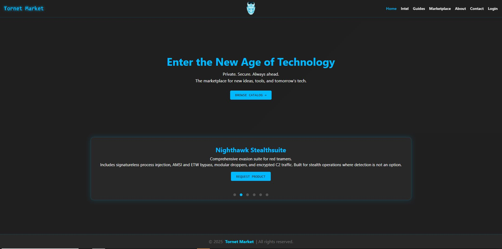

# 🛰️ Tornet Market

> **Private. Secure. Always Ahead.**

Tornet Market is a dark-themed, single-page marketplace for **cutting-edge security tools, scripts, gadgets, and learning resources**.  
Whether you are a red-team operator, bug-bounty hunter, hobbyist maker, or just a curious technologist, Tornet Market brings everything together in one sleek, responsive web app.



---

## ✨ Key Features
| Area | Highlights |
|------|------------|
| **Marketplace** | Category filter, top-selling badge, uniform product cards, instant “Request Product” modal, 5-star “Info” previews with images. |
| **Intel Page**  | Split-view of **Site Update Log** and curated **Industry News & Events** (manually or API-fed). |
| **Guides**      | Downloadable PDF knowledge base (ethical hacking, IoT security, JavaScript exploitation, and more). |
| **Responsive UI** | Desktop, tablet, and mobile layouts with hamburger nav + animated 3D “Tornet Market” logo / GIF blend. |
| **UX Extras**   | Auto-spinning product slideshow, smooth section scrolling, two-second site-update pop-up, and mailto-driven forms. |

---

## 🚀 Tech Stack

| Layer | What we use |
|-------|-------------|
| **Frontend** | Vanilla **HTML5**, **CSS (variables + keyframes)**, and **ES6 JavaScript** (no frameworks required). |
| **Build / Tooling** | Just a modern browser—no bundler needed. |
| **Deploy** | Any static host (GitHub Pages, Netlify, Vercel, S3, etc.). |
| **Future-proof** | Components structured for easy migration to React / Vue or an Astro static build. |

---

## 🖥️ Local Setup

```bash
git clone https://github.com/your-handle/tornet-market.git
cd tornet-market
# no dependencies – open index.html directly
# OR start a quick dev server:
npx serve .
